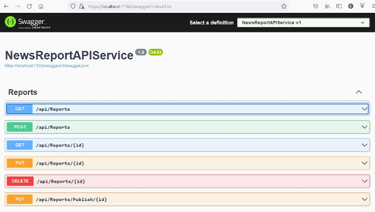

# NewsReportAPIService: TheSwagger UI

### Once the setup and configuration steps have been followed, the application can be run in Visual Studio. 
### The application uses Swagger - which will be loaded in a browser window ( as per [configuration settings](config.md) )

*On Start-up, if there is no data in the database, the API database will be seeded with sample News Reports*

[Back to Index](index.md)

